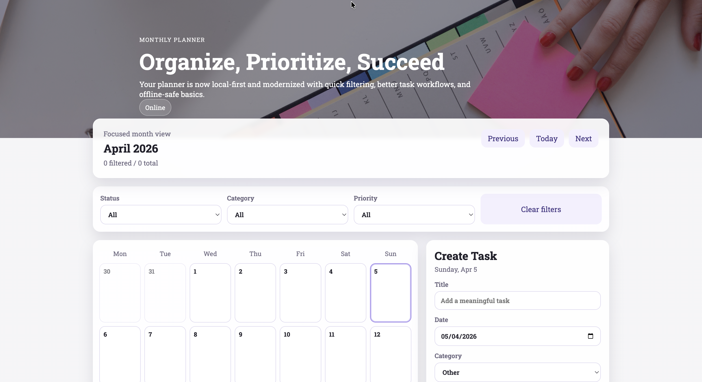

# Monthly Planner

A local-first monthly planner built with **Next.js + TypeScript**. Tasks are stored in the browser — no account, no backend, works offline.

## Live Demo

[monthly-planner-taupe.vercel.app](https://monthly-planner-taupe.vercel.app/)

## Preview



## Features

- Monday-first calendar grid with month navigation
- Create, edit, delete, and quick-complete tasks directly on the calendar
- Task fields: title, date, category, priority, status, notes
- Filter tasks by status, category, and priority
- Offline-ready: service worker + online/offline indicator
- Auto-migrates tasks from the legacy `savedTasks` format on first load

## Run locally

```bash
npm install
npm run dev
```

Open `http://localhost:3000`

## Scripts

```bash
npm run lint        # ESLint
npm run test        # Unit + component tests (Vitest)
npm run test:e2e    # End-to-end tests (Playwright)
npm run build       # Production build
```

## CI/CD

Two GitHub Actions workflows run on every push:

| Workflow | Trigger | What it does |
|---|---|---|
| `CI` | Every push + PR | Lint → unit tests → build → **e2e tests** |
| `CD (Vercel)` | After CI on `main` | Deploys to production via Vercel CLI |

### CD setup (one-time)

Add these secrets to your GitHub repository settings:

- `VERCEL_TOKEN` — from your Vercel account token settings
- `VERCEL_ORG_ID` — from Vercel project settings
- `VERCEL_PROJECT_ID` — from Vercel project settings

Without these, CI still runs but the CD deployment step will fail with a clear error message.

## Test coverage

**Unit** (`src/lib/`)
- Calendar matrix generation with Monday-first week alignment
- Legacy task migration and idempotency
- Storage settings read/write
- Filter logic

**Component** (`src/components/`)
- Create, edit, delete task flow
- Filtering behaviour
- Month navigation across year boundaries

**E2E** (`e2e/`)
- Legacy migration on first load
- Task persistence after page reload
- Offline indicator behaviour

## Architecture

| Path | Responsibility |
|---|---|
| `app/` | Next.js App Router entry, global styles |
| `src/components/planner/` | Calendar grid, task form, filters |
| `src/hooks/use-planner.ts` | All planner state and actions |
| `src/lib/storage.ts` | localStorage persistence and legacy migration |
| `src/lib/date.ts` | Calendar math and date formatting |
| `src/lib/filter.ts` | Task filtering rules |
| `legacy/` | Original vanilla JS app (preserved for reference) |
| `docs/` | Architecture decision records |

## V2 Roadmap

- **Cross-device sync** — replace localStorage with Supabase Postgres or Vercel KV so tasks follow the user across browsers
- **Recurring tasks** — daily, weekly, and monthly repeat patterns
- **Drag-and-drop rescheduling** — move tasks between days directly on the calendar

## What I Learned

**What was harder than expected:** The legacy data migration. Old tasks used different field names (`name` → `title`, `difficulty` → `priority`, `dueDate` as a Unix timestamp) and the migration had to handle every edge case silently without data loss. Writing the `isTaskPayload` validator to guard against malformed localStorage data taught me how much can go wrong at system boundaries.

**What I would do differently:** Start with CSS Modules instead of a single global stylesheet. As the component count grew, managing class name collisions in one file became error-prone. Co-locating styles with components would have made the codebase easier to navigate from day one.

**What I'm most proud of:** The three-layer test suite. Having unit tests for pure logic, component tests for user interactions, and Playwright E2E tests running against the production build in CI gives me real confidence when changing things. Most of the improvements in this project were made safely because the tests caught regressions immediately.
